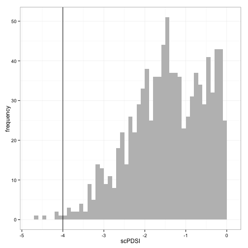
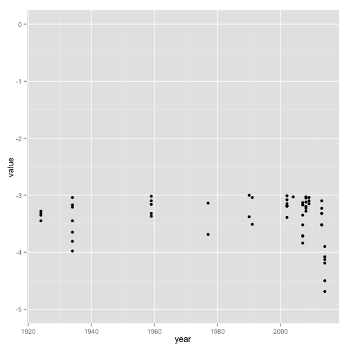

How bad is bad plot 
========================================================

Is the actual drought period really bad? 


#### Get the negative value and plot them 


```r
# subset the data 
negvalue <- mydf[mydf$value<0,]

# Histogram of the negative values 
m <- ggplot(negvalue, aes(value)) + geom_histogram(stat='bin', binwidth=0.1, fill='grey') + 
  xlab('scPDSI') + ylab('frequency') + theme_bw() + geom_vline(x=-4)

m
```

 


How many months are severe or extreme?

```r
# Get all months scPDSI < -3 ('severe') 
severe <- negvalue[which(negvalue[,'value']>-4 & negvalue[,'value']<=-3 ),]
severe <- severe[order(severe$year),]
severe
```

```
##      year value month
## 630  1924 -3.32     6
## 750  1924 -3.45     7
## 870  1924 -3.35     8
## 990  1924 -3.28     9
## 280  1934 -3.21     3
## 400  1934 -3.81     4
## 520  1934 -3.98     5
## 640  1934 -3.65     6
## 760  1934 -3.45     7
## 880  1934 -3.17     8
## 1000 1934 -3.04     9
## 545  1959 -3.10     5
## 665  1959 -3.32     6
## 785  1959 -3.37     7
## 905  1959 -3.16     8
## 1385 1959 -3.02    12
## 323  1977 -3.14     3
## 443  1977 -3.69     4
## 336  1990 -3.00     3
## 456  1990 -3.38     4
## 97   1991 -3.04     1
## 217  1991 -3.51     2
## 468  2002 -3.01     4
## 588  2002 -3.08     5
## 708  2002 -3.15     6
## 828  2002 -3.19     7
## 948  2002 -3.19     8
## 1068 2002 -3.19     9
## 1188 2002 -3.39    10
## 830  2004 -3.03     7
## 353  2007 -3.17     3
## 473  2007 -3.35     4
## 593  2007 -3.71     5
## 713  2007 -3.84     6
## 833  2007 -3.72     7
## 953  2007 -3.52     8
## 1073 2007 -3.13     9
## 1313 2007 -3.17    11
## 474  2008 -3.04     4
## 594  2008 -3.05     5
## 714  2008 -3.23     6
## 834  2008 -3.20     7
## 954  2008 -3.12     8
## 1074 2008 -3.20     9
## 1194 2008 -3.28    10
## 1314 2008 -3.03    11
## 115  2009 -3.15     1
## 475  2009 -3.10     4
## 595  2009 -3.04     5
## 479  2013 -3.32     4
## 599  2013 -3.52     5
## 719  2013 -3.52     6
## 839  2013 -3.32     7
## 959  2013 -3.10     8
## 1439 2013 -3.23    12
## 120  2014 -3.90     1
```

```r
# and scPDSI < -4 ('extreme')
extreme <- negvalue[which(negvalue[,'value']<=-4),]
extreme
```

```
##     year value month
## 240 2014 -4.13     2
## 360 2014 -4.08     3
## 480 2014 -4.19     4
## 600 2014 -4.50     5
## 720 2014 -4.69     6
```

```r
# months in the temporal serie
nrow(mydf)
```

```
## [1] 1440
```


```r
# data for the plot 
sevExt <- negvalue[which(negvalue[,'value']<=-3),]

# how bad is bad plot
ggplot(sevExt, aes(x=year, y=value)) + geom_point() + ylim(-5,0)
```

 

