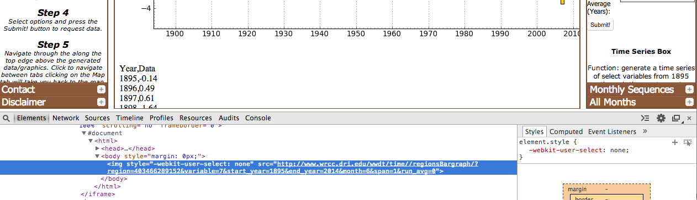
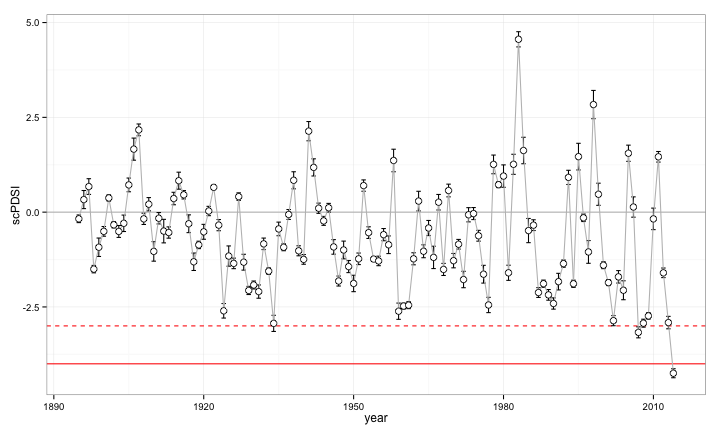
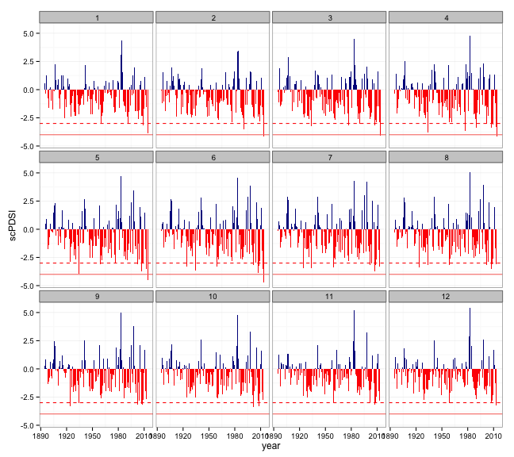
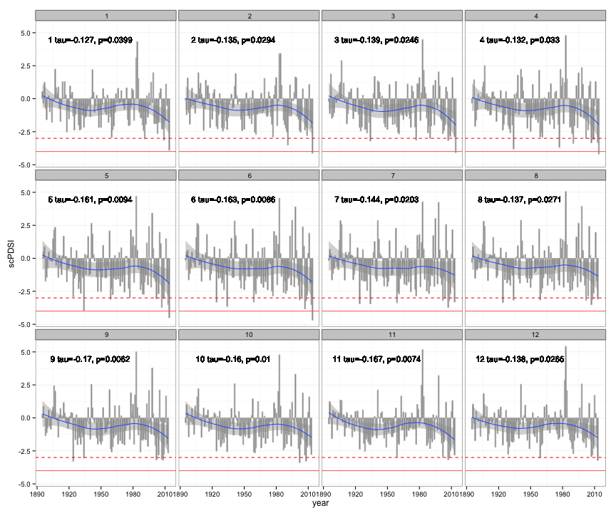

scPDSI 
========================================================
In this document we show our progress on scPDSI.

### Objectives: 
* How bad is current drought? How do drought patterns vary in space and time?
* What is the spatial and temporal dynamics of drought?

#### Download the data 
Why do we need to create a script to download the data?
- Take a look at this web: [West Wide Drought Tracker](http://www.wrcc.dri.edu/wwdt/time)
- We create a script in .bash to do it, but why? 
- An example: To obtain data of scPDSI for CA state of each month, we must to click 12 times, then we obtain a web with a figure and data (1 per month). But this output is difficult to manipulate. We would spend time to select data, download data, accomodate data, ... . We don't have time! We would spend our (scarce)-time to interpret the results and discuss about that. 
- Solution:
- Inspect the element  

Then we obtained the data and save them as .csv file 


```r
# Set directory 
di <- '/Users/ajpeluLap/myrepos/Drought_CA'
mydf <- read.table(paste(di,'/pdsi/scpdsi_CAstate.csv',sep=''), header=TRUE) 
head(mydf)
```

```
##   year value month
## 1 1895  0.55     1
## 2 1896 -0.33     1
## 3 1897  1.23     1
## 4 1898 -0.75     1
## 5 1899 -1.59     1
## 6 1900  0.10     1
```


#### Download the data

```r
# Load packages 
library(ggplot2)
library(Kendall)
library(plyr)
library(mgcv)
```

```
## Loading required package: nlme
## This is mgcv 1.7-29. For overview type 'help("mgcv-package")'.
```


#### Temporal variation of scPDSI
A first vision of scPDSI from 1895 to 2014 for CA state: 


```r
# create a variable to colour the bars of the plot 
mydf$sign <- ifelse(mydf[['value']] >= 0, 'positive', 'negative')

# Plot of scPDSI of CA 
# add lines with Palmer Drought classification's
# http://drought.unl.edu/Planning/Monitoring/ComparisonofIndicesIntro/PDSI.aspx
p0 <- ggplot(mydf, aes(x=year, y=value)) + 
  geom_point(stat = 'identity', colour='gray') + 
  geom_hline(yintercept=c(-3,-4), colour='red', linetype=c('dashed', 'solid')) +
  geom_hline(yintercept=0, colour='black') + ylab('scPDSI') +
  theme(legend.position = 'none', panel.grid.major.x = element_blank()) +
  theme_bw() 
# pdf(paste(di,'/pdsi/figure/CA_drougth.pdf', sep=''),height=5, width=8)
p0
```

 


```r
p00 <- p0 + geom_smooth(method='gam', formula=y~s(x), se=FALSE)
p00
```

 

Take a look in the last years 


```r
## Plot with plotly 

## Load and install need library
library('devtools')
```

```
## 
## Attaching package: 'devtools'
## 
## The following objects are masked from 'package:utils':
## 
##     ?, help
## 
## The following object is masked from 'package:base':
## 
##     system.file
```

```r
#install_github("ropensci/plotly")
library(plotly)
```

```
## Loading required package: RCurl
## Loading required package: bitops
## Loading required package: RJSONIO
```

```r
## Set credentials ()
set_credentials_file(username="macroecologycagroup", api_key="m0q2weomht")
```

```
## [1] "Your credentials file:"
## $username
## [1] "macroecologycagroup"
## 
## $api_key
## [1] "m0q2weomht"
## 
## [1] "Now,"
## [1] "Your credentials file:"
## $username
## [1] "macroecologycagroup"
## 
## $api_key
## [1] "m0q2weomht"
```

```r
# Ploty of Drougth. Focused on the last year
py <- plotly()

p0p <- ggplot(mydf, aes(x=mydf$year, y=mydf$value)) + 
  geom_point(stat = 'identity', colour='gray') 

r <- py$ggplotly(p0p)

# Get url 
r$response$url
```

```
## NULL
```


#### What about the scPDSI by month? 

```r
# Panel plot of the scPDSI by months  
# create a variable to colour the bars of the plot 
mydf$sign <- ifelse(mydf[['value']] >= 0, 'positive', 'negative')

p1 <- ggplot(mydf, aes(x=year, y=value, fill=sign)) + 
  geom_bar(stat = 'identity')  + 
  facet_wrap(~month, ncol=4) + 
  scale_fill_manual(values = c('positive' = 'darkblue', 'negative' = 'red')) + 
  geom_hline(aes(yintercept=-3), colour='red', linetype="dashed") + 
  geom_hline(aes(yintercept=-4, colour='red')) +
  theme_bw() + 
  theme(legend.position = 'none', panel.grid.major.x = element_blank()) + 
  ylab('scPDSI')

# pdf(paste(di,'/pdsi/figure/panelplotCA_drougth.pdf', sep=''),height=10, width=9)
p1 
```

 

And, how about the temporal trend of the scPDSI? 

```r
#### MannKendall test 
# Create a table with MK statistics and its p-value 
mks <- data.frame()
for (i in 1:12){
sb <- mydf[mydf$month==i,]
mk <- MannKendall(sb$value)
mk$month <- i 
mks <- rbind(mks, mk)}

# results 
mks 
```

```
##        tau       sl     S    D   varS month
## 2  -0.1271 0.039871  -907 7134 194356     1
## 21 -0.1347 0.029438  -961 7134 194356     2
## 3  -0.1391 0.024580  -992 7132 194348     3
## 4  -0.1319 0.032991  -941 7135 194358     4
## 5  -0.1606 0.009399 -1146 7135 194356     5
## 6  -0.1625 0.008621 -1159 7131 194349     6
## 7  -0.1441 0.020349 -1011 7014 189551     7
## 8  -0.1373 0.027134  -963 7014 189552     8
## 9  -0.1700 0.006226 -1192 7011 189545     9
## 10 -0.1600 0.010029 -1122 7011 189545    10
## 11 -0.1665 0.007352 -1168 7013 189551    11
## 12 -0.1380 0.026497  -967 7009 189539    12
```

```r
# Create labels with MannKendall results 
mks$label <- paste(mks$month,' tau=',round(mks$tau, 3), ', ', 'p=', round(mks$sl,4), sep='')
```

But... what about do we put together the plot and the temporal trends?  


```r
# Join data 
mydf2 <- join(mydf, mks, by='month')
```


```r
p2 <- ggplot(mydf2, aes(x=year, y=value)) +  ylab('scPDSI') +
  geom_bar(stat = 'identity', colour='gray') +  geom_smooth(method='loess') + 
  facet_wrap(~month, ncol=4) + 
  geom_hline(aes(yintercept=-3), colour='red', linetype="dashed") + 
  geom_hline(aes(yintercept=-4, colour='red')) +
  theme_bw() +
  theme(legend.position = 'none', panel.grid.major.x = element_blank()) 
p3 <- p2 + geom_text(aes(x=1940, y=4.5, label=label), size=4)

ggsave(p3,file=paste(di,'/pdsi/figure/panelPlotCA_month_trends.pdf', sep=''),height=10, width=9)
p3
```

 
 
### Interpretation and discussion of the results:
* What month do we choose? 
* What message do we want to communicate?
 * A frog, q knife and a bear in the room 
 * __Make your messages memorable__ 
* How about entities? We only analyzed data from CA state.
* What outputs do we want for scPDSI: 
 * A plot. Which? 
 * A map. What kind of map? 
* Comments, suggestions, improvements 
